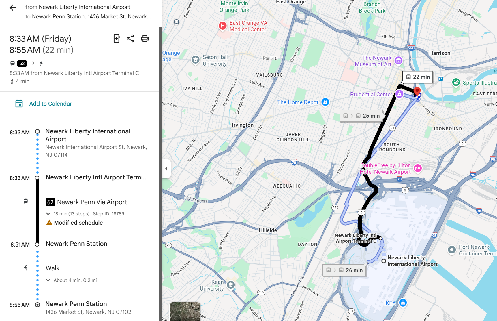
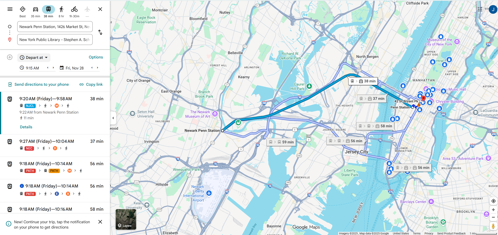
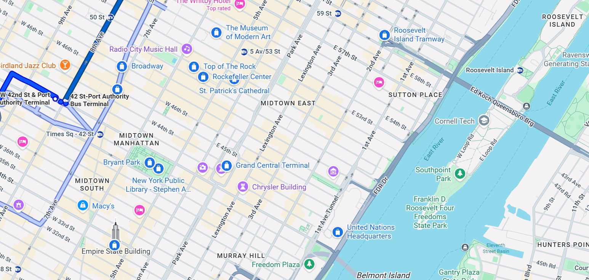

## 纽约计划

2025 fall thanksgiving

- 学校问题
- 飞机问题：选越早的出发，越晚的回程来省住宿费
- 住房问题：就住曼岛内部
- 时间问题：
  - sunrise：6 : 40
  - sunset: 4 : 39

## 价格问题

去michiganflyer：15刀

飞机：来去 80 刀

酒店曼哈顿HI 青旅 4 天225刀

去程 michigan flyer 15刀

机酒总和 225+80+15=320刀

回程车费：19刀

地铁公交：估计坐的非常多，直接封顶价格34刀省不了了

景点全价：83+300+89+20+85+89+60+29+90+70=915

+18刀

总共320+15+19+18=372刀+130刀=500刀

## 景点一览

1. MoMA: 周二闭馆，大部分时间都是10：30-17：30
2. MET:周三闭馆 10：00- 17：00
3. Times Square:目前观望是纯打卡点，离broadway近，可以考虑一起看
4. Top of The Rock：这个贼猛，就在这看夜景
5. Empire State Building：这个就不上去了，附近拍个照
6. NY Public Library:这个也可以去
7. Grand Central terminal:这个拍个照就行了
8. UN Headquarters:参观得预约
9. Roosevelt Island Tramway：看能不能四点去
10. Statue of Liberty：早上去，在下城
11. Wall Street Bull：华尔街上
12. Trinity Church：就在华尔街走一会，晚上6点关门
13. NY Stock Exchange:就在三一教堂旁边
14. World Trade Center：有一个特别的地标去
15. Brooklyn Bridge：都在下城的一片
16. DUMBO：曼哈顿大桥观景点
17. Chinatown：就在曼哈顿大桥上面
18. Washington Square Park：12点关门
19. Vessel：在High lane里面
20. High Line：晚7关门
21. Little Island：晚9关门
22. Broadway：看有没有机会吧
23. chelsea market: 吃东西的
24. St. Patrick's Cathedral：很好看的样子
25. Intrepid Museum：比较靠左边，晚五关门
26. Guggenheim Museum :在central park 右边，可以考虑和MMoA一起逛
27. Museum of Natural History：在中央公园左边
28. trump tower 打个卡就行

## 游玩计划

总游玩时间 28，29，30，1，2实际上非常充裕，有五天

11.28早上3：30起床，准备出门，打车如果打不到的话就只能走50min走到中转站所以时间得留够时间

4：50 - 5：35 坐Michigan flyer

6：15 - 7：58抵达 EWR机场 准备正式开始旅行

### day1 Nov.28 Fri

8点抵达

再坐地铁,最好是坐path便宜，只要3刀

EWR前往图书馆

去图中部分逛完，先去图书馆，bryant park，再去车站，再去教堂，联合国，然后下午逛完RooseveltISland，船去缆车回，，再去艺术馆，再去时代广场，有剧看就看剧，没得看就晃一下回旅馆，早点睡觉，明天早点起。1号线可以很方便回家，看看附近有没有啥吃的
补充：艺术馆开到8：30点，所以可以最后去，逛到8点多回，时间就充裕一些，这样就比较好

#### 购票情况

1. 图书馆
2. 车站
3. 教堂
4. 艺术馆：83元
5. 联合国：18刀，2：45开始/已购
6. RooseveltISland（缆车还有船还有岛上的小景点）

### day2 Nov.29 Sat

先去梦校哥伦比亚大学玩，坐车车去中央公园，再去两个博物馆，MET后去，然后看夜景

#### 购票情况

1. 中央公园：
2. Guggenheim Museum：89元
3. MET：学生票：60元
4. Top of Rock：200元，快通300块钱这个到时候再买
5. 帝国大厦顶：130元

### day3 Nov.30 Sun

先去自然历史博物馆，去左下角的景点，先看无畏号，再去vessel，把little island晃一下，然后在切尔西市场消费一下，然后回家

#### 购票情况

1. 自然博物馆 29 元
2. 无畏号 90元
3. vessel 70元

### day4 Dec.1 Mon

看自由女神像，登岛登岛

登岛细节：待补充

再去9/11纪念馆

先去华尔街那几个地方玩

傍晚前往两座大桥边玩

最后前往唐人街

#### 购票情况

1. 自由女神像：游船+登岛85元
2. 9/11 20元

### day5 Dec.2 Tues

最后购物，去没去过的地方转一下，结束行程，鉴于听说好像交通还是不太方便，6点出发返程，有点晚了就不坐bus了，改坐 NJ transit，一共19刀

#### 购票情况

8点抵达EWR就可以了
