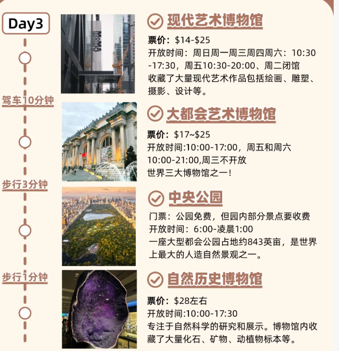

## 纽约计划

2025 fall thanksgiving

- 学校问题
- 飞机问题：选越早的出发，越晚的回程来省住宿费
- 住房问题：就住曼岛内部
- 时间问题：
  - sunrise：6：40
  - sunset: 4:39

## 价格问题

飞机：来去 80 刀

酒店曼哈顿HI 青旅 4 天225刀

去程 michigan flyer 15刀

机酒总和 225+80+15=320刀

## 景点一览

1. MoMA: 周二闭馆，大部分时间都是10：30-17：30
2. MET:周三闭馆 10：00- 17：00
3. Times Square:目前观望是纯打卡点，离broadway近，可以考虑一起看
4. Top of The Rock：这个贼猛，就在这看夜景
5. Empire State Building：这个就不上去了，附近拍个照
6. NY Public Library:这个也可以去
7. UN Headquarters:参观得预约
8. Roosevelt Island Tramway：看能不能四点去
9. Statue of Liberty：早上去，在下城
10. Wall Street Bull：华尔街上
11. Trinity Church：就在华尔街走一会，晚上6点关门
12. NY Stock Exchange:就在三一教堂旁边
13. World Trade Center：有一个特别的地标去
14. Brooklyn Bridge：都在下城的一片
15. DUMBO：曼哈顿大桥观景点
16. Chinatown：就在曼哈顿大桥上面
17. Washington Square Park：12点关门
18. Vessel：在High lane里面
19. High Line：晚7关门
20. Little Island：晚9关门
21. Broadway：看有没有机会吧
22. chelsea market: 吃东西的
23. St. Patrick's Cathedral：很好看的样子
24. Intrepid Museum：比较靠左边，晚五关门
25. Guggenheim Museum :在central park 右边，可以考虑和MMoA一起逛

## 游玩计划

总游玩时间 28，29，30，1，2实际上非常充裕，有五天

11.28早上3：30起床，准备出门，打车如果打不到的话就只能走50min走到中转站所以时间得留够时间

4：50 - 5：35 坐Michigan flyer

6：15 - 7：58抵达 EWR机场 准备正式开始旅行

### day1 Nov.28

8点抵达

